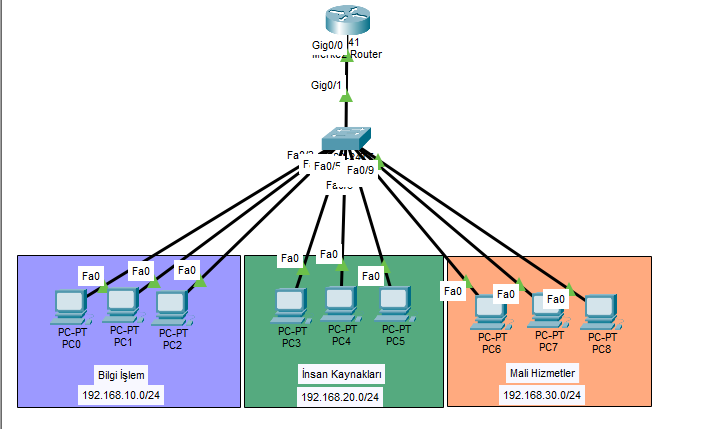
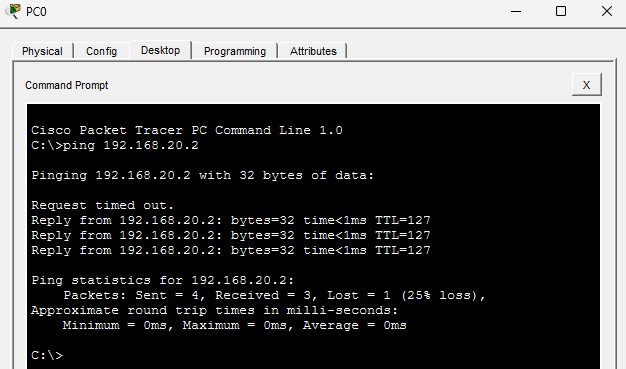

# Kurumsal-VLAN-Ag-Mimarisi
# Kurumsal-VLAN-Ag-Mimarisi

# Kurumsal Ağ ve VLAN Mimarisi Tasarımı

Bu proje, kurumların IT altyapı standartları göz önüne alınarak Cisco Packet Tracer üzerinde tasarlanmış tam fonksiyonel bir yerel ağ (LAN) simülasyonudur. Projenin temel amacı, farklı departmanların ağ trafiklerini birbirinden izole ederek veri güvenliğini sağlamak ve departmanlar arası iletişimi "Router on a Stick" mimarisi ile merkezi olarak yönetmektir.

## 🛠️ Kullanılan Teknolojiler ve Protokoller
* **Cisco Packet Tracer:** Ağ topolojisi tasarımı ve simülasyonu.
* **VLAN (802.1Q):** Bilgi İşlem, İnsan Kaynakları ve Mali Hizmetler departmanları için mantıksal ağ izolasyonu.
* **Inter-VLAN Routing:** Router sub-interface yapılandırması ile izole ağlar arası kontrollü haberleşme.
* **Cisco IOS CLI:** Switch Access/Trunk port yapılandırmaları ve Router statik IP atamaları.

## 🏗️ Ağ Mimarisi ve IP Dağıtım Tablosu
Ağ altyapısı üç ana departman (VLAN) üzerine inşa edilmiş olup, IP blokları `/24` alt ağ maskesi (255.255.255.0) ile yapılandırılmıştır.

| Cihaz Adı | Departman | VLAN ID | IP Adresi | Varsayılan Ağ Geçidi (Gateway) |
| :--- | :--- | :--- | :--- | :--- |
| PC0, PC1, PC2 | Bilgi İşlem | VLAN 10 | 192.168.10.2 - 10.4 | 192.168.10.1 |
| PC3, PC4, PC5 | İnsan Kaynakları | VLAN 20 | 192.168.20.2 - 20.4 | 192.168.20.1 |
| PC6, PC7, PC8 | Mali Hizmetler | VLAN 30 | 192.168.30.2 - 30.4 | 192.168.30.1 |

## 📸 Ağ Topolojisi

## 🔧 Gerçek Hayat Senaryoları ve Sorun Giderme (Troubleshooting)

1. **Zaman Aşımı (Request Timed Out) Analizi:** Farklı VLAN'lardaki cihazlar (Örn: PC0'dan PC3'e) ilk kez haberleştiğinde gönderilen ilk paketin düşmesi ağ dünyasında beklenen bir durumdur. Bu, cihazların fiziksel adresleri öğrenmek için başlattığı ARP (Address Resolution Protocol) yayınından kaynaklanır.
2. **Port ve Kablo Hataları:** Olası bir fiziksel bağlantı kopukluğunda Switch üzerindeki port ışıkları ve RJ45 kablo uçları kontrol edilecek şekilde yapılandırma şeması standartlaştırılmıştır.
3. **Kalıcı Hafıza Kaydı:** Olası elektrik kesintilerine karşı tüm Router ve Switch konfigürasyonları `write memory` komutu ile NVRAM üzerine kalıcı olarak kaydedilmiştir.

## 📡 Haberleşme (Ping) Testi Sonuçları
Aşağıdaki görselde, VLAN 10'da bulunan PC0'ın, VLAN 20'de bulunan PC3 ile başarılı bir şekilde haberleştiği (Inter-VLAN Routing) görülmektedir.

